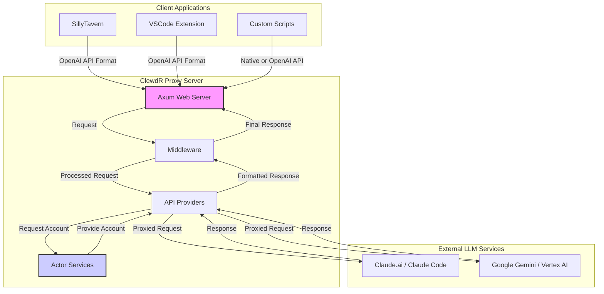

# Architecture: ClewdR

## 1. Core Principles

The architecture of ClewdR is built on several core principles to achieve its goals of high performance, reliability, and low resource usage:

- **Asynchronous Everywhere**: The entire application is built on the Tokio asynchronous runtime, allowing it to handle thousands of concurrent connections with a small number of OS threads.
- **Modularity and Decoupling**: The system is divided into distinct, loosely coupled components (Providers, Services, Middleware) that communicate through well-defined interfaces. This makes the system easier to maintain, test, and extend.
- **State Management with Actors**: Critical shared state, such as the pool of available Cookies and API Keys, is managed by dedicated actors (`CookieActor`, `KeyActor`) using the `ractor` framework. This ensures thread-safe access and prevents race conditions without complex locking.
- **Fail Fast, Recover Smart**: The system is designed to fail fast when a non-recoverable error occurs (like invalid authentication). For transient issues, it previously used intelligent retry mechanisms, which have now been refactored to a more direct error-handling approach.

## 2. High-Level System Diagram

## 3. Component Breakdown

### a. Axum Web Server (`main.rs`, `router.rs`)
- **Entry Point**: The `main.rs` file initializes the tracing subscriber, configuration, actor services, and starts the Axum web server.
- **Routing**: The `router.rs` file defines all API endpoints (e.g., `/v1/messages`, `/v1/chat/completions`) and maps them to the appropriate handler functions. It also applies global middleware.

### b. Middleware (`middleware/`)
- **Authentication (`auth.rs`)**: Extracts the `Bearer Token` or `x-api-key` from incoming requests and injects it into the request extensions for later use. This is the first line of defense.
- **Request Preprocessing (`claude/request.rs`, `gemini/request.rs`)**: Parses the incoming request body, validates it, and transforms it from different API formats (e.g., OpenAI) into the internal `CreateMessageParams` struct. It also creates the initial `Context` object.
- **Response Transformation (`claude/response.rs`)**: Transforms the response from the LLM provider back into the format expected by the client (e.g., OpenAI format).

### c. API Providers (`providers/`)
- **Orchestration Layer**: This is the core logic layer that orchestrates the process of handling a request.
- **`ClaudeWebProvider`, `ClaudeCodeProvider`, `GeminiProvider`**: Each provider is responsible for a specific type of LLM interaction.
- **Logic Flow**:
    1. Receives the preprocessed request and context from the middleware.
    2. Uses the `token` from the context to request a specific account (Cookie/Key) from the corresponding Actor Service.
    3. Initializes a state object (`ClaudeWebState`, `ClaudeCodeState`) with the account details.
    4. Executes the actual API call to the external LLM service.
    5. Returns the response to the middleware for final transformation.

### d. Actor Services (`services/`)
- **`CookieActor`**: Manages the entire lifecycle of Claude cookies. It maintains a pool of valid, exhausted, and invalid cookies. It handles requests for specific cookies based on a `token`, returns them to the pool after use, and persists their state.
- **`KeyActor`**: Performs the same function as the `CookieActor`, but for Google Gemini API keys.
- **Concurrency Control**: By centralizing state management, these actors are the key to the application's ability to handle high concurrency safely and efficiently.

## 4. Data Flow Example (Claude Request)

1.  A client sends a request to `http://127.0.0.1:8484/v1/chat/completions` with an `Authorization: Bearer my-secret-token` header.
2.  The **Axum Server** routes the request to the appropriate handler.
3.  The **Auth Middleware** extracts `"my-secret-token"` and adds it to the request's extensions.
4.  The **Claude Preprocess Middleware** parses the OpenAI-formatted body into `CreateMessageParams` and creates a `ClaudeContext`, setting the token field to `"my-secret-token"`.
5.  The `api_claude_web` handler calls the `ClaudeWebProvider::invoke` method.
6.  The **Provider** retrieves the token from the context and calls `CookieActor::request_by_token("my-secret-token")`.
7.  The **CookieActor** finds or creates the cookie associated with `"my-secret-token"` and returns it.
8.  The **Provider** initializes `ClaudeWebState` with this specific cookie.
9.  `ClaudeWebState` sends the request to the Claude.ai API.
10. The response is passed back up the chain, being transformed by the middleware, and finally sent to the client.